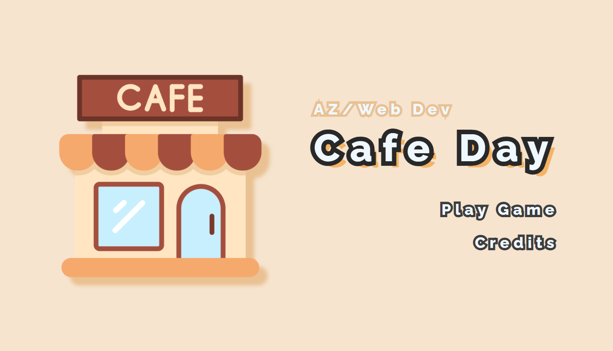
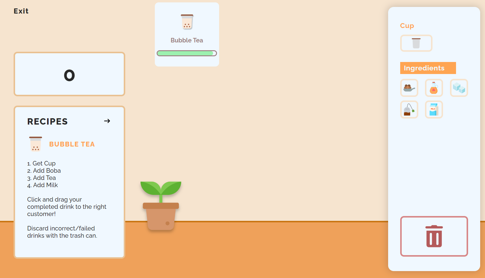
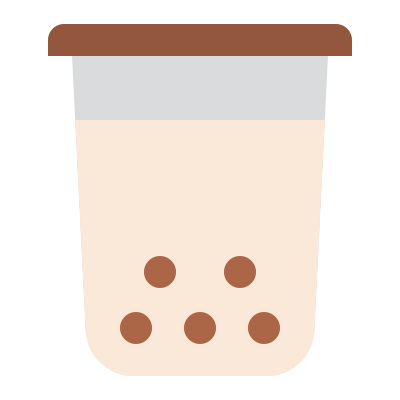
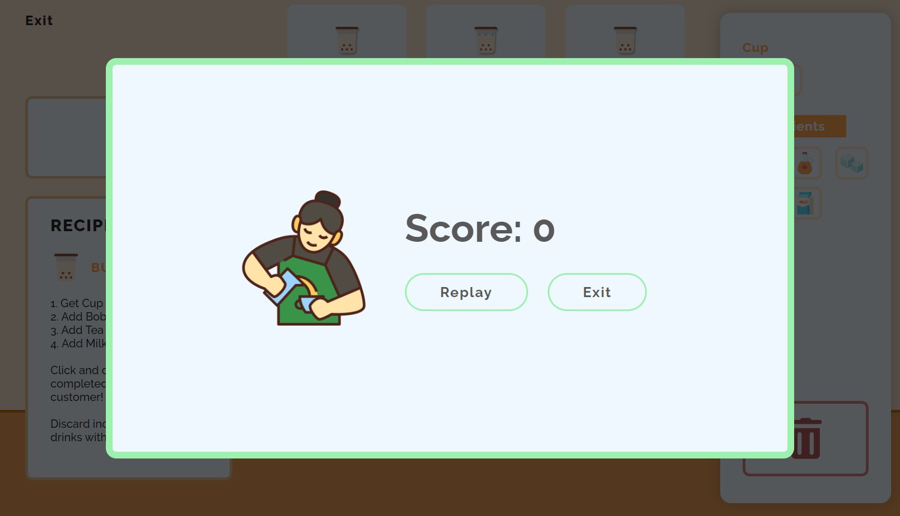
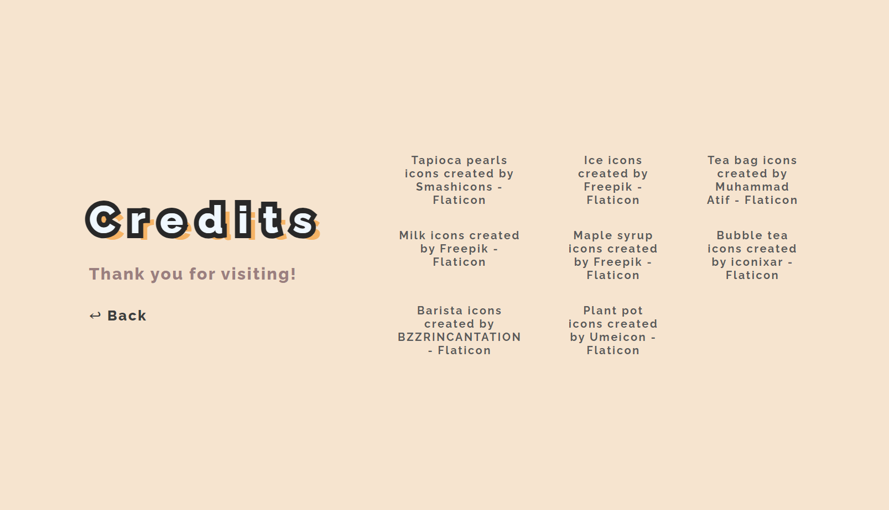

# IDM Web Dev Final Documentation

# Project Overview

****************Cafe Day**************** is a final project developed for NYU Fall 2023 IDM Web Development course. It utilizes HTML, CSS, and vanilla JavaScript to create a cozy cafe game experience. The goal of the game is for the player to serve as many customers as possible without delivering an incorrect order and without letting the timer on the order run out.  The player can make drinks by clicking on ingredients (present in the right panel) in the correct order as per the recipe book. If the player messes up an order, they can discard it with the trash can. After making the drink, the player has to deliver it to the correct customer by dragging and dropping the drink on the corresponding order.

[Cafe Day Preview](docs_assets/preview.mp4)

---

# Code Documentation

# Index



The index, or in this case, the Start Menu, is presented in the following format:

```jsx
<main class="vh-100 start-container">
  <div class="cafe-image-container">
    
  </div>
  <div class="start-menu">
    <div class="start-header">
      <a class="author-link" href="../" data-text="AZ/Web Dev">
        AZ/Web Dev
      </a>
      <h1 data-text="Cafe Day">Cafe Day</h1>
    </div>
    <a class="start-menu-link" href="game.html" data-text="Play Game"
      >Play Game</a
    >
    <a class="start-menu-link" href="credits.html" data-text="Credits">Credits</a>
  </div>
</main>
```

An image of the cafe is displayed to the left of the text. The text consists of a link to my portfolio (AZ/Web Dev), the title of the game/website (Cafe Day), and an option to Play Game (link to Game) or view Credits (link to Credits).

The `data-text` attributes are used for styling purposes - to create the text outline without the outline being inside the text. Example of its usage is as follows:

```jsx
.start-header h1 {
  ...
  position: relative;
}
```

```jsx
.start-header h1::after {
  content: attr(data-text);
  -webkit-text-stroke: 1.2rem var(--primary-dark);
  color: var(--primary-dark);

  position: absolute;
  top: 0;
  left: 0;
  z-index: -1;

  text-shadow: 0.9rem 0.8rem 0 #f5b365;
}
```

This gives the header (Cafe Day) in the start menu the black outline and the orange text shadow as shown.

# Game



The game tracks if the game is over and the number of customers served:

```jsx
let customers_served = 0;
let game_over = false;
```

These two variables will be used through the various systems for the game as defined below.

## Drink System

A tree-based data structure for the recipe is used to determine possible outcomes of the player’s input:

```jsx
const recipes = {
  "cup-item": {
    next: {
      "boba-item": {
        next: {
          "tea-item": {
            next: {
              "milk-item": {
                spr: "images/boba.png",
                drink: "bubble-tea",
              },
            },
            spr: "images/boba2.png",
          },
          "ice-item": {
            next: {
              "tea-item": {
                next: {
                  "milk-item": {
                    spr: "images/iced-boba.png",
                    drink: "iced-bubble-tea",
                  },
                },
                spr: "images/iced-boba2.png",
              },
            },
            spr: "images/iced-boba1.png",
          },
        },
        spr: "images/boba1.png",
      },
      "syrup-item": {
        next: {
          "boba-item": {
            next: {
              "tea-item": {
                next: {
                  "milk-item": {
                    spr: "images/brown-sugar-bubble-tea.png",
                    drink: "brown-sugar-bubble-tea",
                  },
                },
                spr: "images/brown-sugar-boba3.png",
              },
            },
            spr: "images/brown-sugar-boba2.png",
          },
        },
        spr: "images/brown-sugar-boba1.png",
      },
    },
    spr: "images/cup.png",
  },
};
```

Each primary “node” (object) is an ingredient item (which also includes the cup in this case) that holds possible `next` valid ingredients and the path to its sprite (`spr`). It may also hold a `drink` property which identifies the drink it makes based on its identifier/key. The leaf node does not have a `next` property as it is the final node.

An additional special tree/node is defined for failed drinks:

```jsx
const failed_drink = {
  spr: "images/failed_drink.png",
};
```

The player can select ingredients using buttons in the UI in the Ingredients section. It is presented in the following format:

```jsx
<button
    class="ingredient-item-container"
    data-ingredient="boba-item"
  >
    <div class="ingredient-item">
      
    </div>
  </button>
```

The `data-ingredient` custom property holds the ingredient key/identifier, as found in the `recipes` tree. Note that the cup is also considered an ingredient for the purpose of the recipe tree, and is presented in the same fashion (just with different class names for styling purposes).

Each of these buttons have a click event listener for `SelectIngredient(ev)` added through JavaScript. This selects the current ingredient and adds it to the drink that is currently being made:

```jsx
function SelectIngredient(ev) {
  AddIngredient(ev.currentTarget.getAttribute("data-ingredient"));
}
document
  .querySelectorAll(".ingredient-item-container, .cup-item-container")
  .forEach((ingredient_button) =>
    ingredient_button.addEventListener("click", (e) => SelectIngredient(e))
  );

const cup_container = document.querySelector(".cup-container img");
function AddIngredient(ingredient) {
  if (ingredient !== "null") { // valid ingredient
    if (
      cup_container.getAttribute("data-drink") === "" &&
      recipes.hasOwnProperty(ingredient)
    ) { // currently drink station is empty and is adding cup
      // add cup, set sprite, and allow drag
      cup_container.setAttribute(
        "data-drink",
        JSON.stringify(recipes[ingredient])
      );
      cup_container.src = recipes[ingredient].spr;
      cup_container.draggable = true;
    } else if (cup_container.getAttribute("data-drink") !== "") { // drink station not empty
      let curr_drink = JSON.parse(cup_container.getAttribute("data-drink"));
      if (
        curr_drink.hasOwnProperty("next") &&
        curr_drink.next.hasOwnProperty(ingredient)
      ) {
        console.log("Next ingredient ok");
        cup_container.src = curr_drink.next[ingredient].spr;
        cup_container.setAttribute(
          "data-drink",
          JSON.stringify(curr_drink.next[ingredient])
        );
      } else {
        console.log("Does not have next ingredient");
        if (ingredient == "cup-item") return;
        cup_container.src = failed_drink.spr;
        cup_container.setAttribute("data-drink", JSON.stringify(failed_drink));
      }
    }
  }
}
```

The current drink that is being made is identified by the `.cup-container img` element. When the ingredients are added, its sprite (`src`) and custom attribute `data-drink` is updated. The `data-drink` holds the node in the `recipes` tree that the drink currently is at. This allows accessible check to identify if the ingredient that is being added next is valid (this is achieved by checking if the identifier of the ingredient being passed in as a parameter is a property inside the `next` object/property), and update accordingly. The `draggable` attribute is also set to true upon first valid ingredient (the cup) added, so the drink can be submitted for an order (more on this below).

If the next ingredient added is not valid (and is not a cup), the drink fails and it will set the drink as the special failed drink defined earlier.

A trash button is also available to discard the current drink. It simply resets the `data-drink`, sprite (`src`), and `draggable` attribute for the drink. The `src` is given a one-pixel transparent (Base64 encoded) image. Dragging is disabled so the player will not be able to drag an “empty” image.

The player has the option to click on the button, or drag the drink to it. Originally (during prototyping), the button has only allowed click to discard the drink. However, after receiving feedback on it during user testing session, the ability to drag and drop the drink to discard was implemented.

```jsx
<button
  class="trash-item-container"
  onclick="DiscardDrink()"
  ondragover="OnDragOver(event)"
  ondragenter="HighlightTrash(event)"
  ondragleave="StopHighlightTrash(event)"
  ondrop="DiscardDrink()"
>
  <div class="trash-item">
    
  </div>
</button>
```

```jsx
function DiscardDrink() {
  cup_container.setAttribute("data-drink", "");
  cup_container.src =
    "data:image/gif;base64,R0lGODlhAQABAIAAAP///wAAACH5BAEAAAAALAAAAAABAAEAAAICRAEAOw==";
  cup_container.draggable = false;
}
```

- Drag Over (`ondragover`)
    
    Called when the drink is dropped on the trash button. Simply has a `ev.preventDefault()` function call to allow `ondrop` event listeners to work.
    
    ```jsx
    function OnDragOver(ev) {
      ev.preventDefault();
    }
    ```
    
- On Drop (`ondrop`)
    
    For the trash button, the `DiscardDrink()` function is called, much like its `onclick` counterpart.
    
- On Drag Enter (`ondragenter`)
    
    Called when the dragged drink enters the trash button. It adds the `drop-over` class, which simply adds a highlight effect on the button through box shadowing (much like the effect that occurs on hover) to indicate the input has been registered.
    
    ```jsx
    function HighlightTrash(ev) {
      ev.currentTarget.classList.add("drop-over");
    }
    ```
    
- On Drag Leave (`ondragleave`)
    
    Called when the dragged drink leaves the trash button. It removes the `drop-over` class, which removes the highlight effect on the button.
    
    ```jsx
    function StopHighlightTrash(ev) {
      ev.currentTarget.classList.remove("drop-over");
    }
    ```
    

The drink being made (`.cup-container img` element as aforementioned) is presented as such:

```jsx
<div class="cup-container">
  
</div>
```

By default, it presents the one-pixel (Base64 encoded) transparent image with no identifiable drinks `data-drink=""` and set as undraggable. It is also given several functions for implementing its dragging capabilities.

- Drag Start (`ondragstart`)
    
    The moment drag begins, the current drink identified (set by custom property `data-drink`) is sent to the JavaScript Data Transfer object. This is later used by the order to confirm that the drink being submitted is equivalent to the drink being requested/ordered.
    
    ```jsx
    function StartDragDrink(ev) {
      ev.dataTransfer.clearData();
    
      let data_drink = JSON.parse(ev.currentTarget.getAttribute("data-drink"));
      ev.dataTransfer.setData("text/plain", data_drink.drink);
    }
    ```
    
- On Drag (`ondrag`)
    
    While the drag is occurring, the orders (identified by the `.customer-order` elements) and the trash button are given the `await-drop` class, which is simply used for styling purposes - it adds dashed borders around the orders and trash button to indicate that the drink can be dropped on top of them.
    
    ```jsx
    function DragDrink() {
      let orders = document.querySelectorAll(".customer-order");
      orders.forEach((order) => order.classList.add("await-drop"));
    
    	let trash = document.querySelector(".trash-item-container");
      trash.classList.add("await-drop");
    }
    ```
    
- Drag End (`ondragend`)
    
    When the drag ends, the `await-drop` class is removed from the orders (identified by the `.customer-order` elements) and the trash button. This removes the dashed border styling around the orders and trash buttons, which had indicated possible destinations for the drinks. It also resets the `display` style of the  `.order-submit-overlay` to `none`. This is an absolute positioned class (with “Submit Order” text) layered over the order that will show itself when the drink is dragged over the order. It indicates the purpose of dropping the drink on the order.
    
    The shadow around the trash button (given by the `.drop-over` class) is also removed when drag ends.
    
    ```jsx
    function EndDragDrink() {
      let orders = document.querySelectorAll(".customer-order");
      orders.forEach((order) => {
        order.classList.remove("await-drop");
        order.querySelector(".order-submit-overlay").style.display = "none";
      });
    
    	let trash = document.querySelector(".trash-item-container");
      trash.classList.remove("await-drop");
      trash.classList.remove("drop-over");
    }
    ```
    

The drinks can be dragged to an order, which is stored under the `.customers-container` element and presented in the format as follows:

```jsx
<div
  class="customer-order"
  data-order="bubble-tea"
  ondragover="OnDragOver(event)"
  ondrop="ReceiveDrink(event)"
  ondragenter="ShowSubmitOrder(event)"
  ondragleave="HideSubmitOrder(event)"
>
  <div class="order-icon">
    
  </div>
  <p class="order-name">Order Name</p>
  <progress value="32" max="100"></progress>
  <div class="order-submit-overlay">
    <p>Submit Order</p>
  </div>
</div>
```

It has a custom `data-order` attribute which stored the identifier for the drink it intends to receive. It has an `img` element for displaying the order, a `p` element for displaying the name of the order, and a timer shown in the format of a `progress` element. The order also has a `.order-submit-overlay` element — it is an absolute positioned class (with “Submit Order” text) layered over the order that will show itself when the drink is dragged over the order. It indicates the purpose of dropping the drink on the order. Order elements are also given several functions for implementing its dragging capabilities.

- Drag Over (`ondragover`)
    
    Simply has a `ev.preventDefault()` function call to allow `ondrop` event listeners to work.
    
    ```jsx
    function OnDragOver(ev) {
      ev.preventDefault();
    }
    ```
    
- On Drop (`ondrop`)
    
    Called when the drink is dropped on the order. The order is “received” and it determines if the order was successful. The drink that was stored in the JavaScript Data Transfer object is retrieved. It is compared with the `data-order` attribute/property. If it matches, the number of customers served is updated and the order is removed. Otherwise, the game ends. The drink is discarded upon submission and the Data Transfer object is cleared.
    
    ```jsx
    const scoreboard = document.querySelector(".scoreboard h1");
    function ReceiveDrink(ev) {
      let drink = ev.dataTransfer.getData("text/plain");
      let ordered_drink = ev.currentTarget.getAttribute("data-order");
    
      if (drink === ordered_drink) {
        console.log("Successful order");
        ev.currentTarget.parentNode.removeChild(ev.currentTarget);
        SetCustomersServed(++customers_served);
      } else {
        console.log("Unsuccessful order");
        EndGame();
      }
    
      DiscardDrink();
      ev.dataTransfer.clearData();
    }
    ```
    
    ```jsx
    function SetCustomersServed(new_num) {
      customers_served = new_num;
      scoreboard.textContent = customers_served;
    }
    ```
    
- Drag Enter (`ondragenter`)
    
    Called when the dragged drink enters the order element. It shows the `.order-submit-overlay` element. Intended to work in conjunction with the `ondragleave` event listener on the order. See below.
    
    ```jsx
    function ShowSubmitOrder(ev) {
      ev.currentTarget.querySelector(".order-submit-overlay").style.display =
        "flex";
    }
    ```
    
- Drag Leave (`ondragleave`)
    
    Called when the dragged drink leaves the order element. It hides the `.order-submit-overlay` element. Intended to work in conjunction with the `ondragenter` event listener on the order. See above.
    
    ```jsx
    function HideSubmitOrder(ev) {
      ev.currentTarget.querySelector(".order-submit-overlay").style.display =
        "none";
    }
    ```
    

## Customer/Order System

An array of possible drinks (stored as objects) are used to identify possible orders:

```jsx
const drinks = [
  {
    drink: "bubble-tea",
    name: "Bubble Tea",
    spr: "images/boba.png",
    instructions:
      "1. Get Cup\r\n\
      2. Add Boba\r\n\
      3. Add Tea\r\n\
      4. Add Milk",
  },
  {
    drink: "iced-bubble-tea",
    name: "Iced Bubble Tea",
    spr: "images/iced-boba.png",
    instructions:
      "1. Get Cup\r\n\
      2. Add Boba\r\n\
      3. Add Ice\r\n\
      4. Add Tea\r\n\
      5. Add Milk\r\n",
  },
  {
    drink: "brown-sugar-bubble-tea",
    name: "Brown Sugar Bubble Tea",
    spr: "images/brown-sugar-bubble-tea.png",
    instructions:
      "1. Get Cup\r\n\
      2. Add Syrup\r\n\
      3. Add Boba\r\n\
      4. Add Tea\r\n\
      5. Add Milk\r\n",
  },
];
```

Each drink has an identifier (`drink`), name (`name`), path to its sprite (`spr`), and text instructions to make the drink (`instructions`). For the purpose of the customer, all properties except the `instructions` is used. The `instructions` property is used for the [Recipes UI system](#recipes-ui-system).

Orders are generated with `MakeOrder()`. It creates the order as according to the element defined in the comment. A random drink is chosen from the list of possible drinks stored in the `drinks` array. Its sprites, event listeners, and order time is set as appropriate. Order time is reduced as more customer is served to increase game difficulty. The event listeners are used for drink submission/drop purposes, as aforementioned.

```jsx
const customers_container = document.querySelector(".customers-container");
function MakeOrder() {
  `
  <div
    class="customer-order"
    data-order="bubble-tea"
    ondragover="OnDragOver(event)"
    ondrop="ReceiveDrink(event)"
    ondragenter="ShowSubmitOrder(event)"
    ondragleave="HideSubmitOrder(event)"
  >
    <div class="order-icon">
      
    </div>
    <p class="order-name">Order Name</p>
    <progress value="32" max="100">5s</progress>
    <div class="order-submit-overlay">
      <p>Submit Order</p>
    </div>
  </div>
  `;

  let order = drinks[Math.floor(Math.random() * drinks.length)];

  let customer_order = document.createElement("div");
  customer_order.className = "customer-order";
  customer_order.setAttribute("data-order", order.drink);
  customer_order.addEventListener("dragover", (e) => OnDragOver(e));
  customer_order.addEventListener("drop", (e) => ReceiveDrink(e));
  customer_order.addEventListener("dragenter", (e) => ShowSubmitOrder(e));
  customer_order.addEventListener("dragleave", (e) => HideSubmitOrder(e));

  let order_icon = document.createElement("div");
  order_icon.className = "order-icon";
  let order_icon_img = document.createElement("img");
  order_icon_img.src = order.spr;
  order_icon.appendChild(order_icon_img);

  let order_name = document.createElement("p");
  order_name.className = "order-name";
  order_name.textContent = order.name;

  let progress_bar = document.createElement("progress");
  let order_time;
  if (customers_served < 10) {
    order_time = 60;
  } else if (customer_order < 20) {
    order_time = 40;
  } else if (customer_order < 30) {
    order_time = 20;
  } else if (cucstomer_order < 50) {
    order_time = 15;
  } else {
    order_time = 10;
  }
  progress_bar.value = order_time;
  progress_bar.max = order_time;

  let order_submit_overlay = document.createElement("div");
  order_submit_overlay.className = "order-submit-overlay";
  let order_submit_overlay_p = document.createElement("p");
  order_submit_overlay_p.textContent = "Submit Order";
  order_submit_overlay.appendChild(order_submit_overlay_p);

  customer_order.appendChild(order_icon);
  customer_order.appendChild(order_name);
  customer_order.appendChild(progress_bar);
  customer_order.appendChild(order_submit_overlay);

  return customer_order;
}
```

All of the orders are stored in the `.customers-container` element.

The timer for each order is managed and reduced every second by the following function:

```jsx
function DecreaseOrderTimer() {
  if (!game_over) {
    let orders = document.querySelectorAll(".customer-order");
    orders.forEach((order) => {
      let progress_bar = order.querySelector("progress");
      progress_bar.value--;

      if (progress_bar.value <= 0) EndGame();
    });
  }
}
setInterval(DecreaseOrderTimer, 1000);
```

While the game is not over, the order timers will be reduced. The `value` attribute of the progress bar associated with the order is reduced by 1. When it reaches 0, the game ends as the order was not fulfilled during the requested time frame.

The `setInterval` function allows the function to be repeatedly executed every second.

New orders are generated every 5 seconds with the following function:

```jsx
let spawn_new_order_time = 5000;
function AddOrder() {
  if (!game_over) {
    if (customers_container.childElementCount < 3) {
      customers_container.appendChild(MakeOrder());
    }
  }
}
setInterval(AddOrder, spawn_new_order_time);
```

While the game is not over and there is less than three orders currently on the page, new orders will be generated. The `MakeOrder()` function is called and the newly created order is added to the `.customers-container` element, which stores all the orders.

The `setInterval` function allows the function to be repeatedly executed every 5 seconds.

## Recipes UI System

The recipes UI is presented in the following format:

```jsx
<div class="recipes-container">
  <div class="recipes-header">
    <h2>Recipes</h2>
    <div class="recipes-buttons">
      <button class="previous-button">
        
      </button>
      <button class="next-button">
        
      </button>
    </div>
  </div>
  <div class="drink-header">
    
    <h2>Bubble Tea</h2>
  </div>
  <p class="drink-instructions">
    1. Step 1<br />
    2. Step 2<br />
    3. Step 3<br />
  </p>
  <p class="serve-instructions">
    Click and drag your completed drink to the right customer!
		<br /><br />
    Discard incorrect/failed drinks with the trash can.
  </p>
</div>
```

A Previous button and Next button is available to navigate between available recipes. The recipe for the drink is shown with its image, name, instructions (to make the drink), and general serve instructions (which remains the same across all recipes).

An index variable is used to track the current recipe being displayed:

```jsx
let curr_recipe_index = 0;
```

The drink being displayed is modified by the following function:

```jsx
const recipe_img = document.querySelector(".drink-header img");
const recipe_name = document.querySelector(".drink-header h2");
const recipe_instructions = document.querySelector(".drink-instructions");
function DisplayRecipe() {
  recipe_img.src = drinks[curr_recipe_index].spr;
  recipe_name.textContent = drinks[curr_recipe_index].name;
  recipe_instructions.innerText = drinks[curr_recipe_index].instructions;

  previous_button.style.display = curr_recipe_index <= 0 ? "none" : "block";
  next_button.style.display =
    curr_recipe_index >= drinks.length - 1 ? "none" : "block";
}
DisplayRecipe();
```

Based on the current recipe index, it grabs data from the `drinks` array. The image, name, and instructions for the drink are displayed accordingly. Additionally, the availability of the Previous and Next buttons are updated accordingly as well. The Previous button will not be displayed if there are no previous recipes (index is at most 0), and the Next button will not be displayed if there are no next recipes (index is at end of the `drinks` array).

This function is called on load of the page to initialize the Recipe UI (or else it will just display the mock data).

The functionality of the Previous and Next button is defined by the following functions:

```jsx
const previous_button = document.querySelector(".previous-button");
const next_button = document.querySelector(".next-button");
let curr_recipe_index = 0;
previous_button.addEventListener("click", PreviousRecipe);
function PreviousRecipe() {
  if (curr_recipe_index <= 0) return;

  curr_recipe_index--;
  DisplayRecipe();
}

next_button.addEventListener("click", NextRecipe);
function NextRecipe() {
  if (curr_recipe_index >= drinks.length - 1) return;

  curr_recipe_index++;
  DisplayRecipe();
}
```

The Previous button will simply decrement the current recipe index on click (if its not the first recipe) and call `DisplayRecipe()` to update the UI accordingly. Similarly, the Next button will simply increment the current recipe index on click (if its not the last recipe) and call `DisplayRecipe()` to update the UI accordingly.

## Game Over System



The game is over either when the player serves the wrong drink, or they did not fulfill an order on time. The `EndGame()` function is called in these situations to execute the ending of the game. It is defined as follows:

```jsx
const game_over_screen = document.querySelector(".game-over-overlay");
const game_over_score = document.querySelector(".game-over-text-container h1");
function EndGame() {
  game_over_screen.style.display = "flex";
  game_over_score.textContent = `Score: ${customers_served}`;

  game_over = true;
}
```

The `.game-over-overlay` element (an absolute positioned game over screen/element that overlays the entire page) is displayed and the score (number of customer served) is display in a heading text. The `game_over` variable is also updated so other functions (such as the order timer decrement function) will respond appropriately.

The `.game-over-overlay` element is defined as follows:

```jsx
<div class="game-over-overlay">
  <div class="game-over-container">
    
    <div class="game-over-text-container">
      <h1>Score: 20</h1>
      <button class="replay-button">Replay</button>
      <a href="./">Exit</a>
    </div>
  </div>
</div>
```

The game over screen will display the score earned and a button for the option of replaying and exit link to return to the Start screen.

The replay button calls the following function on click:

```jsx
function Replay() {
  DiscardDrink();
  SetCustomersServed(0);
  while (customers_container.firstChild) {
    customers_container.removeChild(customers_container.firstChild);
  }

  game_over_screen.style.display = "none";
  game_over = false;
}
const replay_button = document.querySelector(".replay-button");
replay_button.addEventListener("click", Replay);
```

When the replay function is called, the game state is reset. The drink is discarded, score is reset, previous orders are removed, and the game over screen is hidden. The `game_over` variable is updated accordingly so other functions can respond appropriately with such game state.

# Credits



The credits page contains links to icons used and/or modified in the website. It is presented in the following format:

```jsx
<main class="vh-100 credits-container">
  <div class="credits-menu-container">
    <h1 data-text="Credits">Credits</h1>
    <p>Thank you for visiting!</p>
    <a href="./">↩ Back</a>
  </div>
  <div class="credits-links-container">
    <a
      href="https://www.flaticon.com/free-icons/tapioca-pearls"
      title="tapioca pearls icons"
      >Tapioca pearls icons created by Smashicons - Flaticon</a
    >
    ...
  </div>
</main>
```

The left side has a heading for the page (Credits) and a subtitle to thank the user for visiting. A link to return to the Start Menu is also presented. Each of the links are an anchor element stored under the `credits-links-container`, which displays each link in the format of a grid with three columns.

The `data-text` attributes are used for styling purposes - to create the text outline without the outline being inside the text.